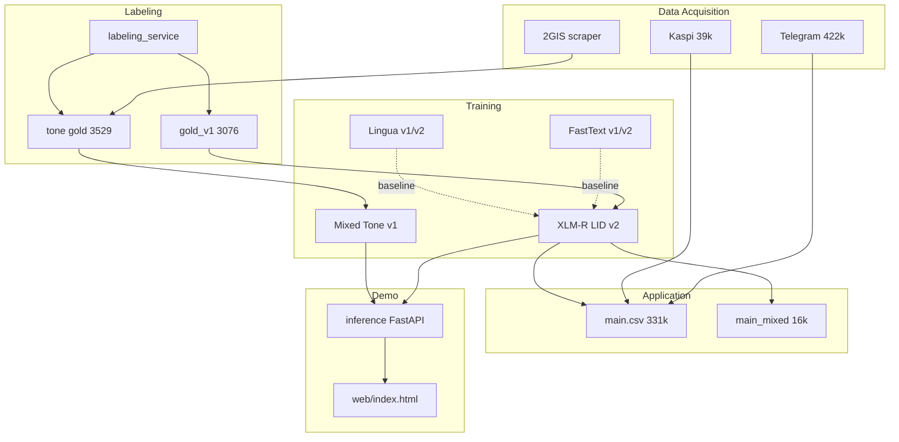

> **Russian version:** [Final_Report_RU.md](Final_Report_RU.md)

# Final Report — KazNLP Capstone

**Project Title:** KazNLP — shala-Kazakh detection (ru / kz / mixed) and tone on mixed reviews  
**Team Name:** Individual capstone  
**Date:** 15/06/26  
**Author:** Bogdan Savelyev  
**Track:** Deep Learning / NLP (transfer learning, transformers)

---

## 1. Introduction

### 1.1 Background Information

**Shala-Kazakh** — switching between Russian and Kazakh in one message — is common in Kazakhstan social media and reviews. Standard LID models (FastText at scrape, heuristics like “Kazakh letters + Cyrillic”) tag up to **98%** false “mixed”: Russian loanwords in Kazakh sentences, emoji, Latin script.

**Mixed example:** «Курьер молодец, уақытында әкелді» — Russian and Kazakh phrases.  
**Not mixed:** «Качествосы жақсы, арзан» — Kazakh grammar with a Russian loan.

Kazakhstani NLP has historically mixed **monolingual Kazakh with loans** and **real code-switching**. Without accurate LID you cannot honestly estimate shala-Kazakh share or train tone on mixed text.

### 1.2 Motivation and Objective

| Field | Content |
|------|------------|
| **Problem** | Automatic LID in KZ social media produces mass false “mixed” |
| **Goal** | High-precision **ru / kz / mixed** filter + tone for confirmed mixed |
| **Baseline** | FastText v1/v2, heuristics, Lingua v1/v2, HeLI/heliport, char-3gram NB |
| **Main model** | XLM-RoBERTa-base (LID v2 + Mixed Tone v1) |
| **Metrics** | macro-F1, per-class P/R, confusion matrix; tone — accuracy + CM |
| **Success** | Gold LID ≥3k, XLM-R > baselines on gold test, demo + labeler + report |

**Capstone goals achieved:**

| Goal | Status |
|------|--------|
| Gold LID ≥ 200 with traceable source | ✅ **3,076** rows |
| Honest baseline + XLM-R superiority | ✅ gold test ladder (§3.3) |
| Metrics + confusion matrices | ✅ LID + tone |
| Pipeline and demo | ✅ inference API + site + labeler |
| Limits and errors | ✅ §3.5, §4.2 |

### 1.3 Members and Role Assignments

| Member | Role |
|--------|------|
| Bogdan Savelyev | Team lead — problem definition, data collection, gold labeling, model training, inference/demo, documentation, presentation |

*Solo capstone project.*

### 1.4 Schedule and Milestones

| Stage | When | Content | Status |
|------|------|------------|--------|
| 1. Problem definition | week 1 | Action Plan, WBS, corpus collection | ✅ |
| 2. Data and baseline | weeks 1–2 | EDA, FastText/Lingua, gold guidelines | ✅ |
| 3. Solution | weeks 2–3 | XLM-R LID v2, Mixed Tone v1, labeler, demo | ✅ |
| 4. Evaluation | week 3 | LID/tone metrics, CM, gold test ladder | ✅ |
| 5. Documentation | week 4 | Final Report, presentation, defense | ✅ report + pptx |

**Methodology:** CRISP-DM. **Main artifact:** `main.ipynb` (274 cells, 7 chapters + §10 model comparison incl. HeLI/heliport + windows grid).

---

## 2. Project Execution

### 2.1 Data Acquisition

| Source | File | Rows | Note |
|----------|------|------:|------------|
| Telegram KZ | `data/raw/telegram_code-switch_dataset.csv` | **422,141** | Telethon; `language` = FastText at scrape, **not ground truth** |
| Kaspi | `data/processed/kaspi_reviews.csv` | **39,129** | Reviews with rating |
| Combined pool (LID v2) | `data/processed/kaspi-telegram_dataset_v2.csv` | **254,652** | After XLM-R v2 scoring |
| 2GIS positive | `data/processed/2gis_reviews_positive.csv` | **35,928** | `collect_2gis_reviews.py` (repo root) |
| 2GIS negative | `data/processed/2gis_reviews_negative.csv` | **29,479** | For tone labeling |
| **Gold LID** | `data/processed/gold_v1.csv` | **3,076** | Manual ru/kz/mixed |
| **Gold tone** | `data/processed/tone_mixed_balanced_audited.csv` | **3,529** | pos/neg on mixed 2GIS |
| **Master corpus** | `data/processed/main.csv` | **331,468** | ru=281,409 · kz=33,695 · mixed=16,364 |
| **Mixed subset** | `data/processed/main_mixed.csv` | **16,364** | `language=mixed` by **XLM-R v2 prediction** |

**Additional:**

- **Heuristic seed pool** (`mixed_heuristic_seed.csv`): **868** texts — for FT v2 and diagnostics, **not gold**.
- **Lingua candidates** (`lingua_candidates.csv`): **6,517** — labeling queue candidates.
- **YouTube** (ch. 2 `main.ipynb`): partial collect (~4.7k), stopped — Telegram + Kaspi + 2GIS enough for capstone.

*Count source:* CSV row counts on disk (June 2026); `main.csv` — final concat cell §7 `main.ipynb` (cell 237).

### 2.2 Training Methodology

#### Language Identification

| Stage | Model | Data | Training |
|------|--------|--------|----------|
| Baseline v1 | FastText supervised | 480k synthetic | `main.ipynb` ch. 1 |
| Baseline v2 | FastText supervised | synthetic + 868 real seeds | `main.ipynb` ch. 3 |
| Lingua v1/v2 | Token-level rules | Telegram/Kaspi samples | `main.ipynb` ch. 4–5 |
| **Production** | **XLM-RoBERTa-base** | `gold_v1` + 538 synthetic **train only** | Kaggle 2× T4, AdamW lr 2e-5 |

**LID split** (`data/training/filter/v1/`), stratified 80/10/10, `random_state=42`:

| Split | Rows | ru | kz | mixed |
|-------|------:|---:|---:|------:|
| train | 2,691 | 740 | 871 | 1,080 |
| val | 462 | 150 | 150 | 162 |
| test | **461** | 150 | 150 | 161 |

Synthetic LID (538 hard patterns, `scripts/merge_synthetic.py`; historical batch scripts in `scripts/archive/`) — **train only**; val/test gold-only.

**LID model input:** column **`text`** (raw comment). Column `text_norm` is for gold QC and dedup but **not used** for XLM-R LID training — intentional: normalization weakens bilingual signal (~219/1077 mixed lose features after strip/casefold).

**XLM-R LID versions:**

| Version | File | macro-F1 (gold test) |
|--------|------|---------------------:|
| v1 | `models/xlm-roberta/xlm-r_v1.pt` | 95.92% |
| **v2** | `models/xlm-roberta/xlm-r_v2.pt` | **96.56%** |

#### Tone (mixed 2GIS reviews)

| Component | Description |
|-----------|----------|
| Gold | 3,529 mixed: pos=1,771, neg=1,758; `label_source`: llm_composer=3,312, manual=217 |
| Synthetic | 882 rows (~20% merged train) — `scripts/generate_tone_synthetic.py` |
| Train merge | `tone_train_mixed.csv` — **4,411** (pos=2,207, neg=2,204) |
| Split | `data/training/tone/v1/`: train **3,334** · val 526 · test **525** |
| Model | XLM-RoBERTa-base, binary pos/neg |
| Production | `models/xlm-roberta/tone_v1.pt` (v2 worse: 96.19% vs 97.33%) |

**RU/KZ tone (pretrained, not project fine-tune):**

| Language | Model | Path |
|------|--------|------|
| ru | RuReviews RuBERT | `models/tone_pretrained/ru_rubert_rureviews/` |
| kz | Kazakh sentiment BERT | `models/tone_pretrained/kz_kazakh_sentiment_bert/` |

### 2.3 Workflow



**Principle:** filter-first — accurate LID on gold first, then corpus scoring, then tone on mixed only.

### 2.4 System Design

**Inference cascade** (`inference/pipeline.py`):

```
text (raw) → XLM-R LID v2 (ru | kz | mixed)
                    ↓
          auto-route (or UI override)
       ┌──────────┼──────────┐
       ru         kz        mixed
       ↓          ↓           ↓
   RuBERT      Kazakh BERT   Tone v1 (XLM-R)
  (pretrained) (pretrained)  (fine-tuned)
       ↓          ↓           ↓
            positive | negative
```

| Endpoint | Role |
|----------|------------|
| `GET /health` | Status of 4 models, device |
| `POST /analyze` | `{text, tone_model: auto\|ru\|kz\|mixed}` → lid, probs, tone |
| `GET /` | Demo site (`web/index.html`) |

**Labeling service** (`python run_labeler.py`): CSV upload, LLM draft (Ollama/Gemini), manual LID/tone labeling, gold export. **51 jobs** in `labeling_service/uploads/`. LLM **excluded from gold LID** (high FP on mixed).

**Demo weights (~8.56 GB):** `python scripts/setup_demo_models.py` → `python run_demo.py`.

---

## 3. Results

### 3.1 Data Preprocessing

**`cheap_clean()`** (Kaspi/Telegram pool): drop empty, dedup by `text`, filter short strings.

**`normalize_text()`** (gold QC, synthetic dedup, scripts):

- strip + casefold;
- remove URLs and @mentions;
- collapse `!!!` / `???`;
- normalize whitespace → column `text_norm` in `gold_v1.csv`.

**FastText synthetic:** `training/fasttext_synthetic.txt` — **480,000** rows (160k/class); split 384k / 96k.

**Max length:** XLM-R LID — training/inference **256** tokens (`inference/config.py`); tone — same.

### 3.2 Exploratory Data Analysis (EDA)

#### Gold LID (3,076 rows)

| Metric | ru | kz | mixed |
|---------|---:|---:|------:|
| Count | 1,000 | 999 | 1,077 |
| Mean length (words) | 13.1 | 10.1 | 11.6 |
| ru+kz chunks in one comment | — | — | 1,057 / 1,077 |
| Duplicates after normalize | 0 | 0 | 0 |

**Key EDA finding:** **kz vs mixed** boundary is the main error source (Russian loanwords).

#### False mixed diagnostics (Telegram)

| Metric | Value | Source |
|---------|----------|----------|
| FT-tagged “mixed” in Telegram | 27,628 (on subset) | `main.ipynb` cells 45–46 |
| True positive (heuristic) | **460** | ~**1.66%** |
| TP from `language=ru` | **411** | hidden mixed |
| Heuristic seeds (dedup) | **868** | `mixed_heuristic_seed.csv` |
| Raw `language=mixed` precision | **2.32%** | 1,542 / 66,462 after FT v2 relabel |

#### Tone gold

- Domain: 2GIS restaurants/services; neg ~138 chars, pos ~95 (length bias).
- ~13% weak code-switch; **94%** tone gold = LLM draft (`llm_composer`), 217 manual.

### 3.3 Modeling

#### 3.3.1 Baselines (non-gold eval sets)

| Model | Eval set | n | Key metric |
|--------|----------|--:|-----------------|
| FastText v1 | synthetic test | 96,000 | F1 = **84.96%** |
| FastText v2 | synthetic test v2 | 2,998 | P/R ≈ **83.46%** |
| FastText v2 | heuristic seeds | 868 | hit rate mixed **95.51%** (829/868) |
| Lingua v1 | seeds | 868 | **71.66%** |
| Lingua v2 | seeds | 868 | **95.97%** |

#### 3.3.2 Gold test comparison — all LID models (n=461)

*Single hold-out:* `data/training/filter/v1/test.csv`. Source: `main.ipynb` §10 (cells 265–273). HeLI/heliport added after Tommi Jauhiainen recommended loanword-neutral re-ID, then overlapping windows with a short grid (`scripts/heli_lid.py`, list `data/processed/heli_loanwords_v1.txt`; best sizes 2+3, min_count=1).

| Model | Accuracy | macro-F1 | R(mixed) | P(mixed) |
|-------|--------:|---------:|---------:|---------:|
| FastText v1 | 64.86% | 63.24% | 33.54% | 55.67% |
| FastText v2 | 71.58% | **70.92%** | 49.07% | 65.83% |
| HeLI raw (heliport) | 70.28% | 69.73% | 53.42% | 58.90% |
| HeLI+neutral (strip loanwords → re-ID) | 68.98% | 68.26% | 49.07% | 57.25% |
| HeLI+windows (grid best: 2+3-word votes, min_count=1) | 87.20% | **86.92%** | 68.94% | 92.50% |
| Char-3gram NB (§10.2, char 3-gram + Laplace) | 88.29% | **88.00%** | 70.81% | 94.21% |
| Lingua v1 | 84.60% | 84.96% | 86.34% | 73.94% |
| Lingua v2 | 88.94% | 88.63% | 98.76% | 76.81% |
| XLM-R LID v1 | 95.88% | 95.92% | — | — |
| **XLM-R LID v2** | **96.53%** | **96.56%** | **95.03%** | **95.03%** |

**XLM-R v2 confusion matrix** (rows=true, cols=pred):

|  | pred ru | pred kz | pred mixed |
|--|--------:|--------:|-----------:|
| **true ru** | **150** | 0 | 0 |
| **true kz** | 0 | **142** | 8 |
| **true mixed** | 2 | 6 | **153** |

Per-class v2: ru P=0.987 R=1.000; kz P=0.960 R=0.947; mixed P=0.950 R=0.950.

**Conclusion:** XLM-R v2 is the only model with balanced mixed P/R ~95% on gold; Lingua v2 has high mixed recall (98.8%) but low precision (76.8%) — unsuitable for corpus filter without manual review. HeLI raw/neutral sit near FastText (~70% macro-F1); Tommi-style loanword strip alone did not help, but **HeLI+windows** after a short grid (best: overlapping **2+3**-word heliport votes, `min_count=1`; tied with 2+3+4) reaches **86.92%** macro-F1 and flips **69/80** of the residual mixed-as-rus bucket to `mixed`, with high mixed precision (92.5%). A smoothed character-trigram NB (§10.2), added because reviewers pointed out that kk and ru share Cyrillic, reaches **88.00%** macro-F1 with near-perfect monolingual accuracy, yet it recovers only **70.8%** of true mixed; character statistics tell the two languages apart but miss the borrowing-vs-switch line that XLM-R gets. A heavier char 2–4 TF-IDF + LinearSVC scored lower (81.1%), so the trigram NB stands in as the character baseline.

#### 3.3.3 Mixed Tone v1

**Test:** `data/training/tone/v1/test.csv`, n=**525** (gold-only hold-out).

| Metric | Tone v1 | Tone v2 (exp.) |
|---------|--------:|---------------:|
| Accuracy | **97.33%** | 96.19% |
| macro-F1 | **97.33%** | 96.19% |

**Confusion matrix v1:** [[257, 6], [8, 254]] — source: `data/processed/metrics_tone_test.json`, `scripts/eval_tone_v1.py`.

*Note:* 94% of tone gold = LLM draft; metric on stratified hold-out from same pool. Manual-only subset (217) — future work.

#### 3.3.4 Corpus application

| Artifact | Rows | Description |
|----------|------:|----------|
| `main.csv` | 331,468 | Full master corpus after XLM-R v2 LID |
| `main_mixed.csv` | 16,364 | **Model-predicted** mixed (not human-audited) |
| `kaspi-telegram_dataset_v2.csv` | 254,652 | Rescored Telegram+Kaspi pool |

Corpus audit of 100 random mixed (Action Plan) — **not done**; mixed precision on gold test (95%) and heuristic audit (1.66% true mixed rate) partially support filter-first approach.

### 3.4 User Interface

| Component | Launch | Role |
|-----------|--------|------------|
| **Demo site** | `python run_demo.py` → http://127.0.0.1:8000/ | Live LID + tone, metrics, narrative |
| **Labeler** | `python run_labeler.py` | Manual LID/tone labeling |
| **API** | `POST /analyze` | Programmatic access |

Demo calls **live API** (`/health`, `/analyze`), no mock. First request may return 503 ~30–60 s (CPU warm-up 4 models).

*Before docx export:* add demo and labeler screenshots to this section.

### 3.5 Testing and Improvements

| Test | File | Coverage |
|------|------|----------|
| API smoke | `inference/test_api.py` | `/health`, 422, e2e |
| Tone eval | `scripts/eval_tone_v1.py` | Reproducible tone metrics |
| Pretrained verify | `scripts/verify_tone_pretrained.py` | RU/KZ smoke |
| Labeler e2e | `labeling_service/test_e2e.py` | Upload flow (Ollama) |

**Typical LID errors:** kz↔mixed (14/16 on test); FP «качествосы жақсы»; FN short mixed without kaz letters.

**Typical tone errors:** mixed sentiment in one review; length/domain shortcut.

**Improvements during project:**

- FastText v1 → v2 (+real seeds) → Lingua → XLM-R v2
- Gold 3076 instead of mass LLM labeling
- Tone v1 > v2; cascade ru/kz/mixed routing
- `eval_tone_v1.py` for reproducible tone metrics
- Gold test ladder §10 for fair baseline comparison

---

## 4. Projected Impact

### 4.1 Accomplishments and Benefits

| Area | Effect |
|-------------|--------|
| **Research** | Balanced gold LID 3,076 for shala-Kazakh; open pipeline |
| **Applied analytics** | 16,364 model-filtered mixed from 331k without labeling full pool |
| **Tooling** | `labeling_service` — reusable labeler for low-resource languages |
| **Education / capstone** | Full DL/NLP cycle: corpus → gold → transformer → cascade → demo |
| **Baseline evidence** | Quantified: ~97.7% of FastText “mixed” labels are noise |

### 4.2 Future Improvements

| Priority | Task |
|-----------|--------|
| P1 | Corpus audit 100 random XLM-R mixed predictions (human precision) |
| P1 | Tone metrics on manual-only subset (217 rows) |
| P2 | Inter-annotator κ on borderline kz/mixed |
| P2 | Neutral class for tone; eval RU/KZ pretrained on KZ data |
| P2 | `score_corpus.py`, Colab export notebook |
| P3 | Cloud deploy; demo video; expand gold beyond 3k |

---

## 5. Team Member Review and Comment

| NAME | REVIEW and COMMENT |
|------|-------------------|
| Bogdan Savelyev | The project met capstone goals: collected 422k+ Telegram corpus, created gold LID 3076, baseline ladder on a single gold test proves XLM-R v2 (96.56% macro-F1). Tone v1 (97.33%) is a stretch goal on 2GIS mixed reviews. Limits (single annotator, LLM tone labels, model-predicted mixed corpus) documented honestly. Demo and labeler run locally. Ready for defense after filling name in docx export. |

---

## 6. Instructor Review and Comment

| CATEGORY | SCORE | REVIEW and COMMENT |
|----------|------:|-------------------|
| IDEA | __/10 | |
| APPLICATION | __/30 | |
| RESULT | __/30 | |
| PROJECT MANAGEMENT | __/10 | |
| PRESENTATION & REPORT | __/20 | |
| **TOTAL** | **__/100** | |

---

## Appendix A — Reproducibility

```bash
pip install -r requirements.txt
pip install -r inference/requirements.txt
python scripts/download_tone_pretrained.py
python scripts/setup_demo_models.py
python run_demo.py
python scripts/eval_tone_v1.py    # tone metrics → metrics_tone_test.json
python -m pytest inference/test_api.py -q
```

**Key artifacts:**

| # | Artifact | Path |
|---|----------|------|
| 1 | Action Plan | `docs/capstone/Action_Plan.md` |
| 2 | WBS | `docs/capstone/WBS.csv` |
| 3 | Notebook | `main.ipynb` |
| 4 | Labeler | `labeling_service/` |
| 5 | Inference | `inference/`, `run_demo.py` |
| 6 | Demo site | `web/index.html` |
| 7 | Gold LID | `data/processed/gold_v1.csv` |
| 8 | LID model | `models/xlm-roberta/xlm-r_v2.pt` |
| 9 | Tone model | `models/xlm-roberta/tone_v1.pt` |
| 10 | Presentation | `docs/capstone/presentation.pptx` |

## Appendix B — Data sources (traceability)

| Metric / claim | Source |
|----------------|--------|
| Corpus row counts | CSV on disk, verified 2026-06-15 |
| LID splits 2691/461/462 | `data/training/filter/v1/*.csv` |
| XLM-R v2 96.56% | `main.ipynb` cells 173, 268 |
| Gold test ladder FT/HeLI/Lingua/XLM-R | `main.ipynb` §10 cells 265–273 |
| Tone 97.33% | `metrics_tone_test.json`, `eval_tone_v1.py` |
| 1.66% true mixed | `main.ipynb` cells 45–46 |
| main.csv 331468 | `main.ipynb` cell 237 + disk |

---

*SIC presentation: `presentation.pptx`. Live defense: `web/story.html`. Before hand-in: `scripts/export_capstone_docs.py`, UI screenshots in §3.4.*
