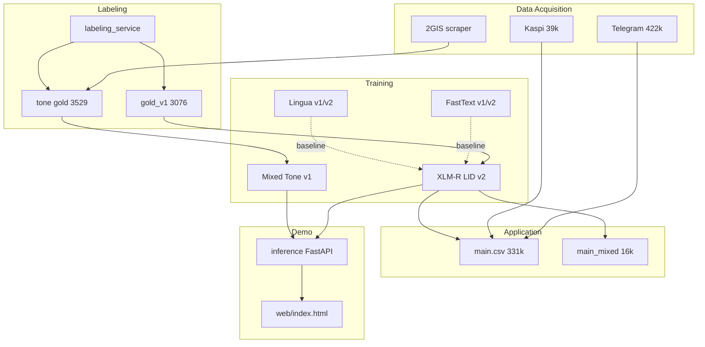

> **English version:** [Final_Report.md](Final_Report.md)

# Final Report — KazNLP Capstone

**Project Title:** KazNLP — детекция шала-казахского (ru / kz / mixed) и тональности смешанных отзывов  
**Team Name:** Individual capstone  
**Date:** 15/06/26  
**Автор:** Bogdan Savelyev  
**Трек:** Deep Learning / NLP (transfer learning, трансформеры)

---

## 1. Introduction

### 1.1 Background Information

В социальных сетях и отзывах Казахстана широко распространён **шала-казахский** — переключение между русским и казахским в одном сообщении. Стандартные LID-модели (FastText при сборе, эвристики «казахские буквы + кириллица») помечают как «mixed» до **98%** ложных случаев: русские заёмные слова в казахском предложении, эмодзи, латиница.

**Пример mixed:** «Курьер молодец, уақытында әкелді» — русская и казахская фразы.  
**Не mixed:** «Качествосы жақсы, арзан» — казахская грамматика с русским заёмом.

Казахстанский NLP historically страдает от смешения **монолингвального кazakh с заёмами** и **настоящего code-switching**. Без точного LID невозможно честно оценить долю шала-казахского и обучать модели тональности на смешанных текстах.

### 1.2 Motivation and Objective

| Поле | Содержание |
|------|------------|
| **Проблема** | Автоматический LID в KZ соцмедиа даёт массовые ложные «mixed» |
| **Цель** | Высокоточный фильтр **ru / kz / mixed** + тональность для подтверждённого mixed |
| **Baseline** | FastText v1/v2, эвристики, Lingua v1/v2 |
| **Основная модель** | XLM-RoBERTa-base (LID v2 + Mixed Tone v1) |
| **Метрики** | macro-F1, per-class P/R, confusion matrix; tone — accuracy + CM |
| **Успех** | Gold LID ≥3k, XLM-R > baselines на gold test, demo + labeler + отчёт |

**Достигнутые цели capstone:**

| Цель | Статус |
|------|--------|
| Gold LID ≥ 200 с проверяемым источником | ✅ **3 076** строк |
| Честный baseline + превосходство XLM-R | ✅ gold test ladder (§3.3) |
| Метрики + confusion matrices | ✅ LID + tone |
| Pipeline и demo | ✅ inference API + сайт + labeler |
| Ограничения и ошибки | ✅ §3.5, §4.2 |

### 1.3 Members and Role Assignments

| Member | Role |
|--------|------|
| Bogdan Savelyev | Team lead — постановка задачи, сбор данных, разметка gold, обучение моделей, inference/demo, документация, презентация |

*Проект выполнен индивидуально (solo capstone).*

### 1.4 Schedule and Milestones

| Этап | Срок | Содержание | Статус |
|------|------|------------|--------|
| 1. Постановка | нед. 1 | Action Plan, WBS, сбор корпуса | ✅ |
| 2. Данные и baseline | нед. 1–2 | EDA, FastText/Lingua, gold guidelines | ✅ |
| 3. Решение | нед. 2–3 | XLM-R LID v2, Mixed Tone v1, labeler, demo | ✅ |
| 4. Оценка | нед. 3 | LID/tone metrics, CM, gold test ladder | ✅ |
| 5. Оформление | нед. 4 | Final Report, презентация, защита | ✅ report + pptx |

**Методология:** CRISP-DM. **Основной артефакт:** `main.ipynb` (272 cells, 7 глав + §10 сравнение моделей, вкл. HeLI/heliport).

---

## 2. Project Execution

### 2.1 Data Acquisition

| Источник | Файл | Строк | Примечание |
|----------|------|------:|------------|
| Telegram KZ | `data/raw/telegram_code-switch_dataset.csv` | **422 141** | Telethon; `language` = FastText при сборе, **не ground truth** |
| Kaspi | `data/processed/kaspi_reviews.csv` | **39 129** | Отзывы с рейтингом |
| Объединённый пул (LID v2) | `data/processed/kaspi-telegram_dataset_v2.csv` | **254 652** | После XLM-R v2 scoring |
| 2GIS positive | `data/processed/2gis_reviews_positive.csv` | **35 928** | `collect_2gis_reviews.py` (корень репо) |
| 2GIS negative | `data/processed/2gis_reviews_negative.csv` | **29 479** | Для tone-разметки |
| **Gold LID** | `data/processed/gold_v1.csv` | **3 076** | Ручная разметка ru/kz/mixed |
| **Gold tone** | `data/processed/tone_mixed_balanced_audited.csv` | **3 529** | pos/neg на mixed 2GIS |
| **Мастер-корпус** | `data/processed/main.csv` | **331 468** | ru=281 409 · kz=33 695 · mixed=16 364 |
| **Mixed-подмножество** | `data/processed/main_mixed.csv` | **16 364** | `language=mixed` по **предсказанию XLM-R v2** |

**Дополнительно:**

- **Heuristic seed pool** (`mixed_heuristic_seed.csv`): **868** текстов — для FT v2 и диагностики, **не gold**.
- **Lingua candidates** (`lingua_candidates.csv`): **6 517** — кандидаты в очередь разметки.
- **YouTube** (гл. 2 `main.ipynb`): частичный сбор (~4.7k), прерван — для capstone достаточно Telegram + Kaspi + 2GIS.

*Источник counts:* CSV row counts на диске (июнь 2026); `main.csv` — финальная concat-ячейка §7 `main.ipynb` (cell 237).

### 2.2 Training Methodology

#### Language Identification

| Этап | Модель | Данные | Обучение |
|------|--------|--------|----------|
| Baseline v1 | FastText supervised | 480k synthetic | `main.ipynb` гл. 1 |
| Baseline v2 | FastText supervised | synthetic + 868 real seeds | `main.ipynb` гл. 3 |
| Lingua v1/v2 | Token-level rules | Telegram/Kaspi samples | `main.ipynb` гл. 4–5 |
| **Production** | **XLM-RoBERTa-base** | `gold_v1` + 538 synthetic **только в train** | Kaggle 2× T4, AdamW lr 2e-5 |

**Split LID** (`data/training/filter/v1/`), stratified 80/10/10, `random_state=42`:

| Split | Строк | ru | kz | mixed |
|-------|------:|---:|---:|------:|
| train | 2 691 | 740 | 871 | 1 080 |
| val | 462 | 150 | 150 | 162 |
| test | **461** | 150 | 150 | 161 |

Synthetic LID (538 hard patterns, `scripts/merge_synthetic.py`; исторические batch-скрипты в `scripts/archive/`) — **только train**; val/test — gold-only.

**Вход модели LID:** колонка **`text`** (сырой текст комментария). Колонка `text_norm` создаётся для QC gold и dedup, но **не используется** при обучении XLM-R LID — намеренное решение: нормализация ослабляет bilingual-сигнал (~219/1077 mixed теряют признаки после strip/casefold).

**XLM-R LID versions:**

| Версия | Файл | macro-F1 (gold test) |
|--------|------|---------------------:|
| v1 | `models/xlm-roberta/xlm-r_v1.pt` | 95.92% |
| **v2** | `models/xlm-roberta/xlm-r_v2.pt` | **96.56%** |

#### Tone (mixed-отзывы 2GIS)

| Компонент | Описание |
|-----------|----------|
| Gold | 3 529 mixed: pos=1 771, neg=1 758; `label_source`: llm_composer=3 312, manual=217 |
| Synthetic | 882 строки (~20% merged train) — `scripts/generate_tone_synthetic.py` |
| Train merge | `tone_train_mixed.csv` — **4 411** (pos=2 207, neg=2 204) |
| Split | `data/training/tone/v1/`: train **3 334** · val 526 · test **525** |
| Модель | XLM-RoBERTa-base, binary pos/neg |
| Production | `models/xlm-roberta/tone_v1.pt` (v2 хуже: 96.19% vs 97.33%) |

**RU/KZ tone (pretrained, не fine-tune проекта):**

| Язык | Модель | Путь |
|------|--------|------|
| ru | RuReviews RuBERT | `models/tone_pretrained/ru_rubert_rureviews/` |
| kz | Kazakh sentiment BERT | `models/tone_pretrained/kz_kazakh_sentiment_bert/` |

### 2.3 Workflow



**Принцип:** filter-first — сначала точный LID на gold, затем скоринг корпуса, затем tone только на mixed.

### 2.4 System Design

**Inference cascade** (`inference/pipeline.py`):

```
text (raw) → XLM-R LID v2 (ru | kz | mixed)
                    ↓
          auto-route (или override в UI)
       ┌──────────┼──────────┐
       ru         kz        mixed
       ↓          ↓           ↓
   RuBERT      Kazakh BERT   Tone v1 (XLM-R)
  (pretrained) (pretrained)  (fine-tuned)
       ↓          ↓           ↓
            positive | negative
```

| Endpoint | Назначение |
|----------|------------|
| `GET /health` | Статус 4 моделей, device |
| `POST /analyze` | `{text, tone_model: auto\|ru\|kz\|mixed}` → lid, probs, tone |
| `GET /` | Demo site (`web/index.html`) |

**Labeling service** (`python run_labeler.py`): CSV upload, LLM draft (Ollama/Gemini), ручная LID/tone разметка, экспорт gold. **51 job** в `labeling_service/uploads/`. LLM **исключён из gold LID** (высокий FP на mixed).

**Веса demo (~8.56 GB):** `python scripts/setup_demo_models.py` → `python run_demo.py`.

---

## 3. Results

### 3.1 Data Preprocessing

**`cheap_clean()`** (Kaspi/Telegram pool): удаление пустых, dedup по `text`, фильтр коротких строк.

**`normalize_text()`** (gold QC, synthetic dedup, скрипты):

- strip + casefold;
- удаление URL и @mentions;
- схлопывание `!!!` / `???`;
- нормализация пробелов → колонка `text_norm` в `gold_v1.csv`.

**FastText synthetic:** `training/fasttext_synthetic.txt` — **480 000** строк (160k/class); split 384k / 96k.

**Max length:** XLM-R LID — training/inference **256** tokens (`inference/config.py`); tone — аналогично.

### 3.2 Exploratory Data Analysis (EDA)

#### Gold LID (3 076 строк)

| Метрика | ru | kz | mixed |
|---------|---:|---:|------:|
| Count | 1 000 | 999 | 1 077 |
| Mean длина (слова) | 13.1 | 10.1 | 11.6 |
| ru+kz chunks в одном комментарии | — | — | 1 057 / 1 077 |
| Дубликаты после normalize | 0 | 0 | 0 |

**Ключевой вывод EDA:** граница **kz vs mixed** — главный источник ошибок (русские заёмные слова).

#### Диагностика false mixed (Telegram)

| Метрика | Значение | Источник |
|---------|----------|----------|
| FT-tagged «mixed» в Telegram | 27 628 (на subset) | `main.ipynb` cells 45–46 |
| True positive (heuristic) | **460** | ~**1.66%** |
| TP из `language=ru` | **411** | hidden mixed |
| Heuristic seeds (dedup) | **868** | `mixed_heuristic_seed.csv` |
| Raw `language=mixed` precision | **2.32%** | 1 542 / 66 462 после FT v2 relabel |

#### Tone gold

- Domain: 2GIS рестораны/сервис; neg ~138 симв., pos ~95 (length bias).
- ~13% weak code-switch; **94%** gold tone = LLM draft (`llm_composer`), 217 manual.

### 3.3 Modeling

#### 3.3.1 Baselines (non-gold eval sets)

| Модель | Eval set | n | Ключевая метрика |
|--------|----------|--:|-----------------|
| FastText v1 | synthetic test | 96 000 | F1 = **84.96%** |
| FastText v2 | synthetic test v2 | 2 998 | P/R ≈ **83.46%** |
| FastText v2 | heuristic seeds | 868 | hit rate mixed **95.51%** (829/868) |
| Lingua v1 | seeds | 868 | **71.66%** |
| Lingua v2 | seeds | 868 | **95.97%** |

#### 3.3.2 Gold test comparison — все LID модели (n=461)

*Единый hold-out:* `data/training/filter/v1/test.csv`. Источник: `main.ipynb` §10 (cells 267–271). HeLI/heliport добавлен после рекомендации Tommi Jauhiainen: нейтрализовать одинаковые русские заимствования и переидентифицировать (`scripts/heli_lid.py`, список `data/processed/heli_loanwords_v1.txt`).

| Model | Accuracy | macro-F1 | R(mixed) | P(mixed) |
|-------|--------:|---------:|---------:|---------:|
| FastText v1 | 64.86% | 63.24% | 33.54% | 55.67% |
| FastText v2 | 71.58% | **70.92%** | 49.07% | 65.83% |
| HeLI raw (heliport) | 70.28% | 69.73% | 53.42% | 58.90% |
| HeLI+neutral (strip loanwords → re-ID) | 68.98% | 68.26% | 49.07% | 57.25% |
| Lingua v1 | 84.60% | 84.96% | 86.34% | 73.94% |
| Lingua v2 | 88.94% | 88.63% | 98.76% | 76.81% |
| XLM-R LID v1 | 95.88% | 95.92% | — | — |
| **XLM-R LID v2** | **96.53%** | **96.56%** | **95.03%** | **95.03%** |

**XLM-R v2 confusion matrix** (rows=true, cols=pred):

|  | pred ru | pred kz | pred mixed |
|--|--------:|--------:|-----------:|
| **true ru** | **150** | 0 | 0 |
| **true kz** | 0 | **142** | 8 |
| **true mixed** | 2 | 6 | **153** |

Per-class v2: ru P=0.987 R=1.000; kz P=0.960 R=0.947; mixed P=0.950 R=0.950.

**Вывод:** XLM-R v2 — единственная модель с balanced mixed P/R ~95% на gold; Lingua v2 имеет высокий recall mixed (98.8%) но низкий precision (76.8%) — непригодна для corpus filter без ручной проверки. HeLI/heliport рядом с FastText (~70% macro-F1) как интерпретируемый не-нейронный baseline; нейтрализация заимствований по совету Томми на этом тесте macro-F1 не подняла (HeLI и так почти всегда ставит gold-kz как `kaz`), а 80 gold-mixed остаются `rus` после стрипа — остаток настоящего переключения.

#### 3.3.3 Mixed Tone v1

**Test:** `data/training/tone/v1/test.csv`, n=**525** (gold-only hold-out).

| Метрика | Tone v1 | Tone v2 (exp.) |
|---------|--------:|---------------:|
| Accuracy | **97.33%** | 96.19% |
| macro-F1 | **97.33%** | 96.19% |

**Confusion matrix v1:** [[257, 6], [8, 254]] — источник: `data/processed/metrics_tone_test.json`, `scripts/eval_tone_v1.py`.

*Примечание:* 94% tone gold = LLM draft; метрика на stratified hold-out из того же пула. Manual-only subset (217) — future work.

#### 3.3.4 Corpus application

| Артефакт | Строк | Описание |
|----------|------:|----------|
| `main.csv` | 331 468 | Полный мастер-корпус после XLM-R v2 LID |
| `main_mixed.csv` | 16 364 | **Model-predicted** mixed (не human-audited) |
| `kaspi-telegram_dataset_v2.csv` | 254 652 | Перескоренный Telegram+Kaspi pool |

Corpus audit 100 random mixed (Action Plan) — **не выполнен**; precision mixed на gold test (95%) и heuristic audit (1.66% true mixed rate) частично обосновывают filter-first подход.

### 3.4 User Interface

| Компонент | Запуск | Назначение |
|-----------|--------|------------|
| **Demo site** | `python run_demo.py` → http://127.0.0.1:8000/ | Live LID + tone, метрики, narrative |
| **Labeler** | `python run_labeler.py` | Ручная LID/tone разметка |
| **API** | `POST /analyze` | Программный доступ |

Demo вызывает **live API** (`/health`, `/analyze`), без mock. Первый запрос может вернуть 503 ~30–60 с (CPU warm-up 4 models).

*Перед экспортом в docx:* добавить скриншоты demo и labeler в этот раздел.

### 3.5 Testing and Improvements

| Тест | Файл | Покрытие |
|------|------|----------|
| API smoke | `inference/test_api.py` | `/health`, 422, e2e |
| Tone eval | `scripts/eval_tone_v1.py` | Reproducible tone metrics |
| Pretrained verify | `scripts/verify_tone_pretrained.py` | RU/KZ smoke |
| Labeler e2e | `labeling_service/test_e2e.py` | Upload flow (Ollama) |

**Typical LID errors:** kz↔mixed (14/16 на test); FP «качествосы жақсы»; FN короткие mixed без kaz letters.

**Typical tone errors:** mixed sentiment в одном отзыве; length/domain shortcut.

**Improvements made during project:**

- FastText v1 → v2 (+real seeds) → Lingua → XLM-R v2
- Gold 3076 вместо mass LLM labeling
- Tone v1 > v2; cascade ru/kz/mixed routing
- `eval_tone_v1.py` для reproducible tone metrics
- Gold test ladder §10 для fair baseline comparison

---

## 4. Projected Impact

### 4.1 Accomplishments and Benefits

| Направление | Эффект |
|-------------|--------|
| **Исследования** | Balanced gold LID 3 076 для шala-казахского; открытый pipeline |
| **Прикладная аналитика** | 16 364 model-filtered mixed из 331k без ручной разметки всего пула |
| **Инструментарий** | `labeling_service` — переиспользуемый labeler для low-resource языков |
| **Образование / capstone** | Полный DL/NLP цикл: corpus → gold → transformer → cascade → demo |
| **Baseline evidence** | Количественно показано: ~97.7% «mixed» меток FastText — шум |

### 4.2 Future Improvements

| Приоритет | Задача |
|-----------|--------|
| P1 | Corpus audit 100 random XLM-R mixed predictions (human precision) |
| P1 | Tone metrics на manual-only subset (217 rows) |
| P2 | Inter-annotator κ на borderline kz/mixed |
| P2 | Neutral class для tone; eval RU/KZ pretrained на KZ data |
| P2 | `score_corpus.py`, Colab export notebook |
| P3 | Cloud deploy; demo video; expand gold beyond 3k |

---

## 5. Team Member Review and Comment

| NAME | REVIEW and COMMENT |
|------|-------------------|
| Bogdan Savelyev | Проект закрыл postановку capstone: собран корпус 422k+ Telegram, создан gold LID 3076, baseline ladder на едином gold test доказывает превосходство XLM-R v2 (96.56% macro-F1). Tone v1 (97.33%) — stretch goal на 2GIS mixed reviews. Ограничения (single annotator, LLM tone labels, model-predicted mixed corpus) задокументированы честно. Demo и labeler работают локально. Готов к защите после подстановки ФИО и экспорта docx. |

---

## 6. Instructor Review and Comment

| CATEGORY | SCORE | REVIEW and COMMENT |
|----------|------:|-------------------|
| IDEA | __/10 | |
| APPLICATION | __/30 | |
| RESULT | __/30 | |
| PROJECT MANAGEMENT | __/10 | |
| PRESENTATION & REPORT | __/20 | |
| **TOTAL** | **__/100** | |

---

## Appendix A — Reproducibility

```bash
pip install -r requirements.txt
pip install -r inference/requirements.txt
python scripts/download_tone_pretrained.py
python scripts/setup_demo_models.py
python run_demo.py
python scripts/eval_tone_v1.py    # tone metrics → metrics_tone_test.json
python -m pytest inference/test_api.py -q
```

**Ключевые артефакты:**

| # | Артефакт | Путь |
|---|----------|------|
| 1 | Action Plan | `docs/capstone/Action_Plan.md` |
| 2 | WBS | `docs/capstone/WBS.csv` |
| 3 | Notebook | `main.ipynb` |
| 4 | Labeler | `labeling_service/` |
| 5 | Inference | `inference/`, `run_demo.py` |
| 6 | Demo site | `web/index.html` |
| 7 | Gold LID | `data/processed/gold_v1.csv` |
| 8 | LID model | `models/xlm-roberta/xlm-r_v2.pt` |
| 9 | Tone model | `models/xlm-roberta/tone_v1.pt` |
| 10 | Presentation | `docs/capstone/presentation.pptx` |

## Appendix B — Data sources (traceability)

| Metric / claim | Source |
|----------------|--------|
| Corpus row counts | CSV on disk, verified 2026-06-15 |
| LID splits 2691/461/462 | `data/training/filter/v1/*.csv` |
| XLM-R v2 96.56% | `main.ipynb` cells 173, 268 |
| Gold test ladder FT/HeLI/Lingua/XLM-R | `main.ipynb` §10 cells 267–271 |
| Tone 97.33% | `metrics_tone_test.json`, `eval_tone_v1.py` |
| 1.66% true mixed | `main.ipynb` cells 45–46 |
| main.csv 331468 | `main.ipynb` cell 237 + disk |

---

*Презентация SIC: `presentation.pptx`. Live на защите: `web/story.html`. Перед сдачей: `scripts/export_capstone_docs.py`, скриншоты UI в §3.4.*
